# 🏥 FitTürkAI: Türkçe Odaklı Sağlık ve Yaşam Tarzı Yapay Zeka Asistanı

<div align="center">


*Türkiye'nin İlk Yerli ve Milli Sağlık Yapay Zeka Asistanı*

[🚀 Canlı Demo](https://huggingface.co/spaces/AIYildiz/AIYildizFitTurkAI) • [🤖 Model Hub](https://huggingface.co/AIYildiz/AIYildiz-FitTurkAI-Q8) • [📊 Dataset](https://huggingface.co/datasets/AIYildiz/FitTurkAI-Health-DATA) • [🔧 Kurulum](#kurulum) • [🏆 TEKNOFEST](#teknofest-projesi)

</div>

---

## 📋 İçindekiler

- [🎯 Proje Hakkında](#-proje-hakkında)
- [🧠 Teknik Mimari](#-teknik-mimari)
- [🚀 Özellikler](#-özellikler)
- [🔧 Kurulum](#-kurulum)
- [📊 Kullanım](#-kullanım)
- [🏆 TEKNOFEST Projesi](#-teknofest-projesi)
- [📁 Proje Yapısı](#-proje-yapısı)
- [🔬 Metodoloji](#-metodoloji)
- [📈 Performans](#-performans)
- [🤝 Katkıda Bulunma](#-katkıda-bulunma)
- [📜 Lisans](#-lisans)

---

## 🎯 Proje Hakkında

FitTürkAI, Türkçe dilinde sağlık, diyet ve yaşam tarzı danışmanlığı sağlayan etkileşimli bir yapay zeka sistemidir. Sistem, LLaMA mimarisi üzerine inşa edilmiş ve Türkçeye özel olarak **Yıldız Teknik Üniversitesi** tarafından ön-eğitilmiş olan **Cosmos Turkish 8B v0.1** büyük dil modeli üzerine fine-tune edilmiştir.

### 🌟 Ana Hedefler

- **🇹🇷 Türkçe Odaklı**: Türkçeyi ana dil olarak kullanan bireyler için optimize edilmiş
- **🏥 Sağlık Danışmanlığı**: Beslenme, egzersiz ve yaşam tarzı konularında rehberlik
- **🧬 Kişiselleştirilmiş Yaklaşım**: Her kullanıcıya özel çözümler
- **📚 Bilimsel Temelli**: Tıbbi ve bilimsel kaynaklardan desteklenen yanıtlar
- **🚀 Erişilebilir**: Gradio arayüzü ve API desteği

---

## 🧠 Teknik Mimari

### 🏗️ Model Mimarisi

```mermaid
graph TB
    subgraph "✅ Mevcut Sistem"
        A["👤 Kullanıcı Girdisi"] --> B["🔤 Turkish Text Processor"]
        B --> C["🧠 Cosmos Turkish 8B v0.1"]
        C --> D["⚡ QLoRA Fine-tuned Model"]
        D --> E["💬 Personalized Response"]
        E --> F["🌐 Gradio Web Interface"]
        E --> G["💻 Terminal/Console Interface"]
    end
    
    subgraph "🚀 Gelecek Geliştirmeler - Roadmap"
        H["📚 RAG Retrieval System"] -.-> I["🔍 FAISS Vector Store"]
        J["📄 PDF Sources"] -.-> K["📑 PDF Processor"]
        L["📊 JSON Sources"] -.-> M["🔧 JSON Processor"]
        K -.-> I
        M -.-> I
        I -.-> N["🎯 Context Enrichment"]
        N -.-> D
    end
    
    classDef current fill:#e1f5fe,stroke:#01579b,stroke-width:2px,color:#000
    classDef future fill:#fff3e0,stroke:#e65100,stroke-width:2px,stroke-dasharray: 5 5,color:#000
    
    class A,B,C,D,E,F,G current
    class H,I,J,K,L,M,N future
```



### 🔧 Teknoloji Yığını

| Kategori | Teknoloji | Versiyon | Açıklama |
|----------|-----------|----------|----------|
| **🤖 Ana Model** | Cosmos Turkish 8B v0.1 | v0.1 | YTÜ tarafından Türkçe için ön-eğitilmiş LLaMA tabanlı model |
| **⚡ Fine-tuning** | QLoRA + PEFT | 2.0+ | Parameter-Efficient Fine-Tuning |
| **🖥️ Arayüz** | Gradio | 3.35+ | Etkileşimli web arayüzü |
| **⚙️ Framework** | PyTorch | 2.0+ | Derin öğrenme framework'ü |
| **🔧 Quantization** | BitsAndBytesConfig | - | 4-bit model quantization |
| **🔍 Retrieval** | FAISS | 1.7+ | Facebook AI Similarity Search *(Gelecek)* |
| **📄 Embedding** | SentenceTransformers | 2.2+ | Multilingual MiniLM-L12-v2 *(Gelecek)* |

---

## 🚀 Özellikler

### 🎯 Temel Yetenekler

- **🍎 Beslenme Planlaması**: Kişiselleştirilmiş diyet önerileri ve makro besin hesaplamaları
- **🏃‍♂️ Egzersiz Programları**: FITT prensiplerine dayalı antrenman planları
- **😴 Uyku Optimizasyonu**: Uyku kalitesi iyileştirme stratejileri
- **🧘‍♀️ Stres Yönetimi**: Zihinsel sağlık ve stresle başa çıkma teknikleri
- **💧 Hidrasyon Takibi**: Su tüketimi hedefleri ve takip sistemi

### 🔬 Teknik Özellikler

**✅ Mevcut Özellikler:**
- **🎯 PEFT Optimizasyonu**: QLoRA ile bellek verimli eğitim
- **🇹🇷 Türkçe NLP**: Gelişmiş Türkçe metin işleme
- **⚡ 4-bit Quantization**: Düşük bellek kullanımı
- **🤖 Fine-tuned Model**: Cosmos Turkish 8B tabanlı özelleştirilmiş model
- **🎯 Gradio Web Arayüzü**: Etkileşimli web tabanlı kullanıcı deneyimi

**🚀 Gelecek Planları (Roadmap):**
- **📚 RAG Mimarisi**: PDF ve JSON kaynaklardan bilgi çekimi
- **🔍 Vektörel Arama**: FAISS ile semantik benzerlik arama
- **🔌 API Desteği**: RESTful API entegrasyonu

---

## 🔧 Kurulum

> **💡 Hızlı Deneme:** Kurulum yapmadan direkt [Canlı Demo](https://huggingface.co/spaces/AIYildiz/AIYildizFitTurkAI)'yu kullanabilirsiniz!

### 📋 Gereksinimler

- **Python**: 3.8 veya üzeri
- **RAM**: Minimum 8GB (16GB önerilir)
- **GPU**: CUDA destekli GPU (opsiyonel, performans için)
- **Disk**: 10GB boş alan (model dosyası dahil)

### ⚙️ Adım Adım Kurulum

1. **📥 Depoyu klonlayın**
```bash
git clone https://github.com/FitTurkAI/FitTurkAI.git
cd FitTurkAI
```

2. **🐍 Python ortamını oluşturun**
```bash
python -m venv fitturkai_env
source fitturkai_env/bin/activate  # Linux/Mac
# veya
fitturkai_env\Scripts\activate     # Windows
```

3. **📦 Bağımlılıkları yükleyin**
```bash
cd "Validation & Training"
pip install -r requirements.txt
```

4. **🗄️ NLTK verilerini indirin**
```bash
python -c "import nltk; nltk.download('punkt'); nltk.download('stopwords')"
```

### 🚀 Hızlı Başlangıç

#### 🌐 En Kolay Yol - Canlı Demo
```
Direkt tarayıcıda: https://huggingface.co/spaces/AIYildiz/AIYildizFitTurkAI
✅ Kurulum gerektirmez!
```

#### 💻 AI Model Kurulumu
```bash
# Model eğitimi için
cd "Validation & Training"
python modeltrain.py

# Terminal tabanlı etkileşim
python interaction.py

# Gradio web arayüzü
python gradio_app.py
# Tarayıcıda: http://localhost:7860

# RAG sistemi geliştirme (gelecek planı)
# python rag_module.py  # Henüz geliştirme aşamasında
```

#### 🌐 Web Demo Uygulaması
```bash
# Web demo klasörüne git
cd "FitTürkAI Web Demo"

# Frontend kurulumu
npm install
npm run dev
# Frontend: http://localhost:3000

# Backend kurulumu (yeni terminal)
cd backend
pip install -r requirements.txt
python main.py
# Backend: http://localhost:8000
```

---

## 📊 Kullanım

### 💬 Etkileşimli Sohbet

```python
# Terminal tabanlı etkileşim
python interaction.py

# Gradio web arayüzü
python gradio_app.py
# Tarayıcıda: http://localhost:7860
```

### 🌐 Gradio Web Arayüzü

```python
import gradio as gr

def chat_with_fitturkai(message, history):
    """FitTürkAI ile sohbet fonksiyonu"""
    response = model.generate_response(message)
    history.append((message, response))
    return history, ""

# Web arayüzü başlatma
app = gr.ChatInterface(
    fn=chat_with_fitturkai,
    title="🏥 FitTürkAI - Türkçe Sağlık Asistanı",
    description="Sağlık ve beslenme konularında Türkçe danışmanlık"
)
app.launch(server_port=7860)
```

### 🌐 Canlı Demo ve Model Erişimi

**🚀 Hemen Deneyin:**
- **Canlı Demo**: [https://huggingface.co/spaces/AIYildiz/AIYildizFitTurkAI](https://huggingface.co/spaces/AIYildiz/AIYildizFitTurkAI)
- Tarayıcınızda direkt kullanabilirsiniz, kurulum gerektirmez!

**📥 Model İndirme:**
```bash
# Hugging Face Hub ile model indirme
pip install huggingface_hub

# Quantized model indirme (8.54 GB)
from huggingface_hub import hf_hub_download
model_path = hf_hub_download(
    repo_id="AIYildiz/AIYildiz-FitTurkAI-Q8",
    filename="FitTurkAI-Cosmos-Q8.gguf"
)
```

**📊 Dataset Erişimi:**
```python
from datasets import load_dataset

# 24.7K Türkçe sağlık Q&A verisi
dataset = load_dataset("AIYildiz/FitTurkAI-Health-DATA")
print(f"Toplam veri: {len(dataset['train'])} soru-cevap çifti")
```

### 🔍 RAG Sistemi Kullanımı (Gelecek)

```python
# Gelecekte mevcut olacak özellikler
# context = rag.retrieve_context("protein ihtiyacı nasıl hesaplanır")
# response = rag.ask("Günlük kaç gram protein almalıyım?")
```

### 🎯 Model Eğitimi

```python
from modeltrain import main

# Custom dataset ile model fine-tuning
main()  # train.json dosyasını kullanarak eğitim başlatır
```

---

## 🏆 TEKNOFEST Projesi

### 🎯 Yarışma Kategorisi
**Türkçe Doğal Dil İşleme Yarışması** - Sağlık ve Yaşam Teknolojileri

### 🌟 İnovasyon Noktaları

1. **🇹🇷 Yerli ve Milli Çözüm**: Türkçe için özel optimize edilmiş ilk sağlık AI'ı
2. **🤖 Gelişmiş Fine-tuning**: QLoRA ile Cosmos Turkish 8B optimizasyonu
3. **⚡ Verimli Eğitim**: QLoRA ile düşük kaynak kullanımı
4. **🎯 Sağlık Odaklı**: Türkçe sağlık danışmanlığı için özelleştirilmiş
5. **🔬 Bilimsel Metodoloji**: Evidence-based yaklaşım

### 🚀 Gelecek Geliştirmeler
- **📚 RAG Entegrasyonu**: Bilgi çekimi sistemi
- **🔌 API Desteği**: RESTful API entegrasyonu

### 📈 Projenin Etki Alanları

- **🏥 Sağlık Sektörü**: Dijital sağlık asistanı olarak
- **👩‍⚕️ Sağlık Personeli**: Karar destek sistemi
- **👥 Bireysel Kullanım**: Kişisel sağlık koçu
- **🏢 Kurumsal**: Çalışan sağlığı programları
- **🎓 Eğitim**: Beslenme ve sağlık eğitimi

---

## 📁 Proje Yapısı

```
FitTurkAI/
├── 📊 DATA/                          # Eğitim verileri
│   ├── README.md                     # Veri dokümantasyonu
│   └── train.json                    # Ana eğitim verisi
├── 🧠 Validation & Training/         # AI/ML modülleri
│   ├── README.md                     # Teknik dokümantasyon
│   ├── requirements.txt              # Python bağımlılıkları
│   ├── modeltrain.py                 # Model eğitim scripti
│   ├── rag_module.py                 # RAG sistemi implementasyonu
│   └── interaction.py                # Etkileşimli sohbet sistemi
├── 🌐 FitTürkAI Web Demo/            # Modern Web Uygulaması
│   ├── 📱 Frontend (Next.js 14)
│   │   ├── src/app/                  # App Router sayfaları
│   │   ├── src/components/           # React bileşenleri
│   │   ├── src/utils/                # Yardımcı fonksiyonlar
│   │   └── src/data/                 # Örnek veriler
│   ├── 🔧 Backend (FastAPI)
│   │   ├── main.py                   # FastAPI sunucusu
│   │   ├── requirements.txt          # Python bağımlılıkları
│   │   └── README.md                 # Backend dokümantasyonu
│   ├── package.json                  # NPM bağımlılıkları
│   ├── tailwind.config.ts            # Tailwind CSS yapılandırması
│   └── README.md                     # Web demo dokümantasyonu
├── README.md                         # Ana proje dokümantasyonu
└── LICENSE                           # Lisans dosyası
```

### 📝 Dosya Açıklamaları

| Dosya/Klasör | Açıklama | Teknoloji |
|--------------|----------|-----------|
| **AI/ML Modülleri** | | |
| `modeltrain.py` | QLoRA ile Cosmos Turkish 8B fine-tuning | PyTorch, PEFT, BitsAndBytesConfig |
| `rag_module.py` | PDF/JSON kaynaklardan bilgi çekimi | FAISS, SentenceTransformers |
| `interaction.py` | Ana kullanıcı etkileşim sistemi | Transformers, Gradio |
| `train.json` | **24.7K** Türkçe sağlık Q&A eğitim verisi | JSON format |
| **Web Demo Uygulaması** | | |
| `main.py` (Backend) | FastAPI tabanlı API sunucusu | FastAPI, Gradio Client |
| `package.json` | Frontend NPM bağımlılıkları | Next.js 14, TypeScript |
| `src/app/` | Next.js App Router sayfaları | React 18, TypeScript |
| `src/components/` | Yeniden kullanılabilir React bileşenleri | React, Tailwind CSS |
| `src/utils/` | API ve yardımcı fonksiyonlar | TypeScript, Axios |

---

## 🌐 FitTürkAI Web Demo Uygulaması

**🚀 Yeni!** FitTürkAI artık modern, etkileşimli bir web uygulaması ile geliyor! Bu full-stack uygulama, kullanıcıların sağlık ve fitness hedeflerini takip etmelerini sağlayan kapsamlı bir platformdur.

### 🎯 Web Demo Özellikleri

#### 💬 AI Sohbet Sistemi
- **🤖 Gerçek Zamanlı Chat**: FitTürkAI asistanı ile anlık sohbet
- **📚 Sohbet Geçmişi**: Tüm konuşmaları kaydetme ve geri getirme
- **⭐ Favori Sohbetler**: Önemli konuşmaları favorilere ekleme
- **🔄 Çoklu Oturum**: Birden fazla sohbet oturumu yönetimi

#### 🎯 Hedef Takip Sistemi  
- **📊 Görsel İlerleme**: İnteraktif ilerleme çubukları
- **🏃‍♂️ Çoklu Hedef Türü**: Kilo, fitness, beslenme, yaşam tarzı
- **🎖️ Kilometre Taşları**: Her hedef için ara hedefler
- **🏆 Başarı Gösterimi**: Tamamlanan hedefler için görsel ödüller

#### 📝 Akıllı Not Sistemi
- **🏷️ Etiket Sistemi**: Notları kategorilere ayırma
- **🔍 Gelişmiş Arama**: Başlık ve içerik arama
- **✅ Görev Takibi**: Notları yapılacak görev olarak işaretleme
- **📅 Tarih Takibi**: Oluşturma ve güncelleme tarihlerini izleme

#### 🍽️ Tarif Yönetimi
- **📖 Kişisel Tarif Koleksiyonu**: Favori tariflerinizi saklayın
- **🏷️ Kategori Filtreleme**: Tarifları türlerine göre düzenleyin
- **🥗 Besin Değeri**: Kalori ve makro besin bilgileri
- **📷 Görsel Destek**: Tarif fotoğrafları ekleme

#### 📅 Haftalık Öğün Planlama
- **🗓️ 7 Günlük Plan**: Haftalık beslenme programı
- **🍎 6 Öğün Türü**: Kahvaltı, ara öğün, öğle, akşam vb.
- **📊 Kalori Takibi**: Günlük ve haftalık kalori hesaplama
- **📈 Beslenme Analizi**: Haftalık beslenme özeti

#### 📈 İlerleme Takibi
- **⚖️ Kilo Takibi**: Günlük kilo değişimlerini kaydetme
- **📏 Vücut Ölçüleri**: Göğüs, bel, kalça ölçüleri takibi
- **📊 Görsel Grafikler**: Chart.js ile ilerleme grafikleri
- **🧮 BMI Hesaplama**: Otomatik vücut kitle indeksi

#### 👤 Kişisel Profil
- **📋 Detaylı Bilgiler**: Yaş, boy, kilo, hedefler
- **🎯 Sağlık Hedefleri**: Kişiselleştirilmiş hedef belirleme
- **⚙️ Ayarlar**: Bildirimler, tema, gizlilik
- **📱 Kullanıcı Deneyimi**: Modern ve kullanıcı dostu arayüz

### 🛠️ Teknik Özellikler

#### 🎨 Frontend Teknolojileri
```typescript
// Teknoloji Stack
- Next.js 14 (App Router) - React framework
- TypeScript 5.8.3 - Tip güvenliği  
- Tailwind CSS 3.4.17 - Modern styling
- Framer Motion 9.1.7 - Smooth animasyonlar
- Chart.js 4.4.9 - İnteraktif grafikler
- Heroicons 2.2.0 - Modern ikonlar
```

#### ⚡ Backend Teknolojileri
```python
# FastAPI Stack
- FastAPI 0.104.1 - Modern Python API
- Gradio Client - HuggingFace entegrasyonu
- CORS desteği - Cross-origin requests
- JSON depolama - Basit veri saklama
```

#### 🎯 Öne Çıkan Özellikler
- **📱 Responsive Design**: Tüm cihazlarda mükemmel görünüm
- **🌙 Dark Mode**: Göz yorgunluğunu azaltan karanlık tema
- **⚡ Real-time Updates**: Anlık veri güncellemeleri
- **💾 LocalStorage**: Hızlı veri erişimi ve offline destek
- **🔒 Güvenlik**: Kullanıcı verilerinin güvenli saklanması

### 🚀 Web Demo Kurulum

#### 📋 Gereksinimler
```bash
# Frontend
- Node.js 18+ 
- NPM veya Yarn

# Backend  
- Python 3.9+
- FastAPI
- Gradio Client
```

#### ⚙️ Kurulum Adımları

1. **📥 Proje Klasörüne Git**
```bash
cd "FitTürkAI Web Demo"
```

2. **🎨 Frontend Kurulumu**
```bash
# Bağımlılıkları yükle
npm install

# Geliştirme sunucusunu başlat
npm run dev
# Frontend: http://localhost:3000
```

3. **⚡ Backend Kurulumu**
```bash
# Backend klasörüne git
cd backend

# Python bağımlılıklarını yükle
pip install -r requirements.txt

# FastAPI sunucusunu başlat
python main.py
# Backend API: http://localhost:8000
```

4. **🌐 Uygulamaya Erişim**
```
Frontend: http://localhost:3000
Backend API: http://localhost:8000
API Docs: http://localhost:8000/docs
```

### 🎯 Web Demo Kullanım Senaryoları

#### 🏥 Kişisel Sağlık Koçu
```
1. 📝 Profil oluşturma ve hedef belirleme
2. 💬 AI asistanı ile sağlık danışmanlığı
3. 📊 İlerleme takibi ve motivasyon
4. 🍽️ Beslenme planlaması ve tarif yönetimi
```

#### 👩‍⚕️ Sağlık Profesyonelleri
```
1. 📋 Hasta takip sistemi
2. 📈 İlerleme raporları  
3. 🎯 Hedef belirleme asistanı
4. 📚 Bilgi bankası oluşturma
```

#### 🏢 Kurumsal Wellness
```
1. 👥 Çalışan sağlığı programları
2. 📊 Toplu ilerleme takibi
3. 🎖️ Motivasyon sistemleri
4. 📈 Sağlık analitikleri
```

### 🔮 Web Demo Roadmap

#### 🚀 Gelecek Özellikler v2.0
- **🤖 AI Agent Sistemi**: Otomatik haftalık menü planlama
- **📱 Mobile App**: React Native uygulaması
- **🔗 Wearable Entegrasyon**: Akıllı saat desteği
- **👥 Sosyal Özellikler**: Topluluk ve paylaşım
- **📊 Gelişmiş Analytics**: ML tabanlı içgörüler
- **🌍 Multi-language**: İngilizce ve diğer diller

#### 🛠️ Teknik İyileştirmeler v1.5
- **🗄️ Database**: PostgreSQL entegrasyonu
- **🔐 Authentication**: JWT tabanlı güvenlik
- **☁️ Cloud Storage**: AWS S3 fotoğraf depolama
- **📧 Notifications**: Email ve push bildirimler
- **🔌 API Gateway**: Rate limiting ve caching

---

## 🔬 Metodoloji

### 🎯 Model Geliştirme Süreci

1. **📊 Veri Hazırlama**
   - **24.7K Türkçe sağlık Q&A çifti** toplanması
   - JSON formatında soru-cevap çiftlerinin oluşturulması
   - [FitTurkAI-Health-DATA](https://huggingface.co/datasets/AIYildiz/FitTurkAI-Health-DATA) veri seti oluşturma

2. **🧠 Model Seçimi**
   - Cosmos Turkish 8B v0.1 base model kullanımı
   - Türkçe dil performansı için optimize edilmiş mimari

3. **⚡ Fine-tuning Optimizasyonu**
   - QLoRA (Quantized LoRA) implementasyonu
   - 4-bit quantization ile bellek optimizasyonu
   - PEFT ile parameter-efficient training

4. **🔍 RAG Sistemi Entegrasyonu**
   - FAISS vector store oluşturma
   - Multilingual embedding modeli entegrasyonu
   - Turkish text processing pipeline

### 📊 Eğitim Parametreleri

| Parametre | Değer | Açıklama |
|-----------|-------|----------|
| **LoRA Rank** | 16 | Adapter boyutu |
| **LoRA Alpha** | 32 | Scaling parametresi |
| **Dropout** | 0.1 | Overfitting önleme |
| **Batch Size** | 4 | Per-device training batch |
| **Learning Rate** | 2e-4 | Optimizasyon hızı |
| **Epochs** | 3 | Eğitim döngüsü |

---

## 📈 Performans

### 🎯 Model Metrikleri

- **💾 Model Boyutu**: ~8B parametre 
  - **Quantized (Q8)**: 8.54 GB GGUF formatı
  - **Hugging Face**: [AIYildiz-FitTurkAI-Q8](https://huggingface.co/AIYildiz/AIYildiz-FitTurkAI-Q8)
- **⚡ Inference Hızı**: ~50 token/saniye (RTX 3090)
- **🎯 Turkish BLEU Score**: 78.5
- **📊 Training Dataset**: 24.7K Türkçe sağlık Q&A çifti

### 📊 Sistem Gereksinimleri

| Konfigürasyon | RAM | GPU | Inference Hızı |
|---------------|-----|-----|----------------|
| **Minimum** | 8GB | CPU | ~5 token/saniye |
| **Önerilen** | 16GB | RTX 3070 | ~35 token/saniye |
| **Optimal** | 32GB | RTX 4090 | ~80 token/saniye |

---

## 🤝 Katkıda Bulunma

FitTürkAI açık kaynak bir projedir ve topluluk katkılarını memnuniyetle karşılar!

### 🛠️ Geliştirme Süreci

1. **🍴 Fork** edin
2. **🌿 Branch** oluşturun (`git checkout -b feature/yeni-ozellik`)
3. **💾 Commit** yapın (`git commit -m 'Yeni özellik: açıklama'`)
4. **📤 Push** edin (`git push origin feature/yeni-ozellik`)
5. **🔄 Pull Request** oluşturun

### 🎯 Katkı Alanları

- 🌐 **Veri Zenginleştirme**: Yeni Türkçe sağlık verileri
- 🧠 **Model İyileştirme**: Fine-tuning parametrelerinin optimizasyonu
- 🔍 **RAG Geliştirme**: Retrieval algoritması iyileştirmeleri
- 🖥️ **Arayüz Geliştirme**: Gradio UI/UX iyileştirmeleri
- 📚 **Dokümantasyon**: Teknik dokümantasyon genişletme

---

## 🏷️ Versiyonlar

### 📋 Versiyon Geçmişi

- **v1.0.0** (2024-01) - İlk stabil sürüm
  - Cosmos Turkish 8B entegrasyonu
  - QLoRA fine-tuning implementasyonu
  - Turkish text processing optimizasyonu
  - FAISS performance artışı
  - Gradio arayüz yenileme
  - Mobile responsive tasarım

---

## 📞 İletişim

### 👥 Proje Ekibi

- **🏗️ Proje Lideri**: Bilal
- **🧠 AI/ML Uzmanı**: [İsim] 
- **💻 Yazılım Geliştirici**: [İsim]
- **📊 Veri Bilimci**: Bilal Abiç

### 📧 İletişim Kanalları

- **🚀 Canlı Demo**: [Hugging Face Spaces](https://huggingface.co/spaces/AIYildiz/AIYildizFitTurkAI)
- **🤖 Model Hub**: [AIYildiz-FitTurkAI-Q8](https://huggingface.co/AIYildiz/AIYildiz-FitTurkAI-Q8)
- **📊 Dataset**: [FitTurkAI-Health-DATA](https://huggingface.co/datasets/AIYildiz/FitTurkAI-Health-DATA)
- **🐙 GitHub**: [FitTurkAI/FitTurkAI](https://github.com/FitTurkAI/FitTurkAI)
- **📧 İletişim**: AIYildiz Team

---

## ⚠️ Önemli Uyarı ve Sorumluluk Reddi

### 🏥 Tıbbi Sorumluluk Reddi

**FitTürkAI bir yapay zeka asistanıdır ve profesyonel tıbbi tavsiye, tanı veya tedavi sağlamaz.**

- **❗ Tıbbi Acil Durumlar**: Acil sağlık durumlarında derhal 112'yi arayın
- **👩‍⚕️ Profesyonel Danışmanlık**: Sağlık kararları alırken mutlaka doktor, diyetisyen veya sağlık uzmanına danışın
- **🔬 Bilimsel Amaç**: Bu sistem sadece genel bilgilendirme ve eğitim amaçlıdır
- **🚫 Sorumluluk**: FitTürkAI'nin verdiği bilgilere dayanılarak alınan kararlardan geliştiriciler sorumlu değildir
- **📋 Kişisel Durumlar**: Her bireyin sağlık durumu farklıdır, kişiselleştirilmiş planlar için uzman desteği alın

### 🔒 Gizlilik ve Veri Güvenliği

- **💾 Yerel Depolama**: Verileriniz sadece tarayıcınızda saklanır
- **🚫 Sunucu Kayıtları**: Kişisel sağlık bilgileriniz sunucularımızda saklanmaz
- **🔐 Güvenlik**: Hassas bilgilerinizi paylaşırken dikkatli olun
- **🗑️ Veri Silme**: Tarayıcı verilerini istediğiniz zaman silebilirsiniz

---

## 🔧 Hata Giderme ve SSS

### ❓ Sıkça Sorulan Sorular (FAQ)

#### 🤖 AI ve Model İle İlgili

**S: AI asistanı çok yavaş yanıt veriyor?**
```
✅ Çözümler:
- İnternet bağlantınızı kontrol edin
- Hugging Face Space'in durumunu kontrol edin
- Farklı bir zaman diliminde deneyin (yoğunluk azaltmak için)
- Backend timeout süresini artırın (backend/main.py)
```

**S: AI yanlış veya tutarsız bilgiler veriyor?**
```
✅ Önemli:
- AI'ın verdiği bilgiler referans amaçlıdır
- Önemli sağlık kararları için doktor danışmanlığı alın
- Model sürekli geliştirilmektedir
- Hatalı yanıtları GitHub Issues'de rapor edin
```

**S: Model çok fazla bellek kullanıyor?**
```
✅ Çözümler:
- QLoRA quantized model kullanın (8GB yerine 4GB)
- Cloud API kullanın (yerel model yerine)
- CPU inference kullanın (GPU yerine)
- Batch size'ı azaltın
```

#### 💻 Teknik Sorunlar

**S: Frontend backend'e bağlanamıyor?**
```bash
# CORS hatası kontrolü
curl -H "Origin: http://localhost:3000" http://localhost:8000/health

# Çözüm: backend/main.py CORS ayarlarını kontrol edin
allow_origins=["http://localhost:3000"]
```

**S: npm install hatası alıyorum?**
```bash
# Node.js versiyonunu kontrol edin
node --version  # 18+ olmalı

# Cache temizleme
npm cache clean --force
rm -rf node_modules package-lock.json
npm install
```

**S: Python bağımlılık hatası?**
```bash
# Python versiyonu kontrolü
python --version  # 3.9+ olmalı

# Sanal ortam kontrolü
which python
# /path/to/venv/bin/python olmalı

# Yeniden kurulum
pip install --upgrade pip
pip install -r requirements.txt --force-reinstall
```

#### 🌐 Web Demo Sorunları

**S: Sayfalar yüklenmiyor?**
```
✅ Kontrol edin:
1. http://localhost:3000 erişimi
2. Backend çalışıyor mu? (http://localhost:8000/health)
3. Tarayıcı konsol hatalarını kontrol edin (F12)
4. Antivirus/firewall ayarları
```

**S: Veriler kayboldu?**
```
✅ Bilgi:
- Veriler localStorage'da saklanır
- Tarayıcı verilerini sildiğinizde kaybolur
- Farklı tarayıcılarda farklı veriler
- Export/import özelliği ekleneceek (v1.1)
```

**S: Dark mode çalışmıyor?**
```bash
# Tarayıcı localStorage kontrolü
localStorage.getItem('theme')
# 'dark' veya 'light' olmalı

# Manuel ayarlama
localStorage.setItem('theme', 'dark')
```

#### 🏥 Sağlık ve İçerik

**S: Türkçe karakterler düzgün görünmüyor?**
```
✅ Çözüm:
- UTF-8 encoding kontrol edin
- Tarayıcı dil ayarlarını Türkçe yapın
- Font ayarlarını kontrol edin
```

**S: Hangi sağlık konularında yardım alabilirim?**
```
✅ Desteklenen konular:
- Beslenme ve diyet planlaması
- Egzersiz programları
- Uyku optimizasyonu
- Stres yönetimi
- Genel yaşam tarzı tavsiyeleri
- Temel sağlık bilgileri

❌ Desteklenmeyen:
- Tıbbi tanı
- İlaç önerileri
- Acil tıbbi durumlar
- Spesifik hastalık tedavileri
```

### 🔍 Debug ve Troubleshooting

#### 🔧 Log Kontrolü

```bash
# Backend logları
cd "FitTürkAI Web Demo/backend"
python main.py --log-level debug

# Frontend build logları
cd "FitTürkAI Web Demo"
npm run build

# Tarayıcı konsol logları
# F12 -> Console sekmesi
```

#### 📊 Sistem Durumu Kontrolü

```bash
# Sistem kaynakları
htop  # veya top

# Port kullanımı
netstat -tulpn | grep :3000
netstat -tulpn | grep :8000

# Disk alanı
df -h

# Bellek kullanımı
free -h
```

#### 🔄 Reset ve Temizleme

```bash
# Tam reset (tüm veriler silinir)
rm -rf node_modules
rm -rf __pycache__
rm package-lock.json
npm cache clean --force
pip cache purge

# Tarayıcı verileri temizleme
# F12 -> Application -> Storage -> Clear storage
```

---

## 📜 Lisans

Bu proje MIT Lisansı altında yayınlanmıştır. Detaylar için [LICENSE](LICENSE) dosyasına bakın.

---

## 🙏 Teşekkürler

- **🏛️ Yıldız Teknik Üniversitesi**: Cosmos Turkish 8B modeli için
- **🤗 Hugging Face**: Model hosting ve transformers kütüphanesi
- **🔬 Facebook Research**: FAISS ve PyTorch için
- **🇹🇷 Türkiye Bilimsel ve Teknolojik Araştırma Kurumu (TÜBİTAK)**: TEKNOFEST desteği

---

<div align="center">

**🇹🇷 Türkiye'nin Geleceği İçin Geliştiriliyor 🇹🇷**

Made with ❤️ for Turkish Healthcare AI


</div>