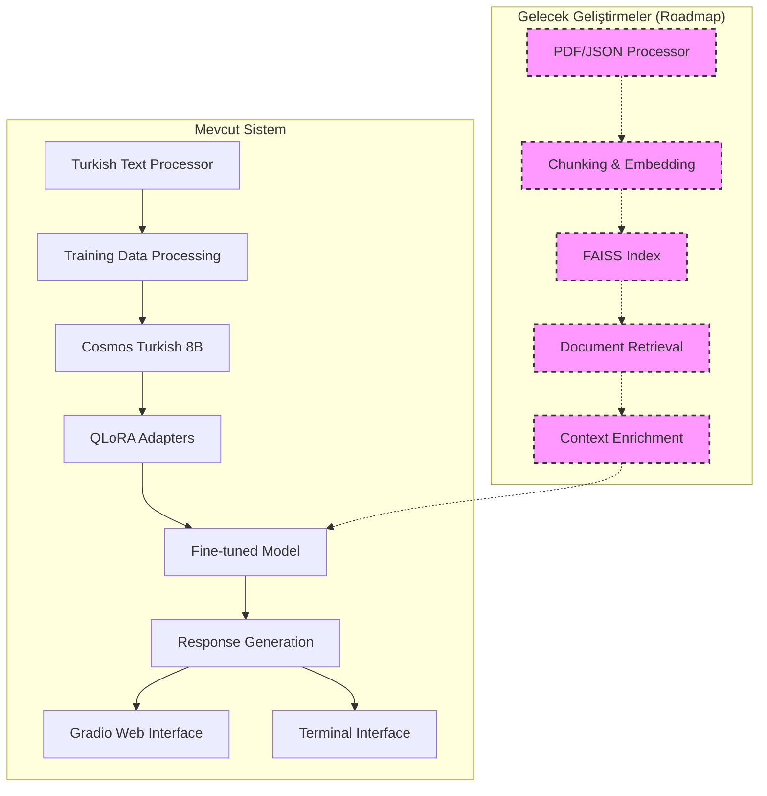

# 🧠 FitTürkAI AI/ML Bileşenleri

<div align="center">


*Türkçe Sağlık AI için Gelişmiş Makine Öğrenmesi Altyapısı*

</div>

---

## 📋 İçindekiler

- [🎯 Modüller Hakkında](#-modüller-hakkında)
- [🏗️ Sistem Mimarisi](#️-sistem-mimarisi)
- [🔧 Kurulum ve Konfigürasyon](#-kurulum-ve-konfigürasyon)
- [📁 Modül Detayları](#-modül-detayları)
- [🚀 Kullanım Kılavuzu](#-kullanım-kılavuzu)
- [⚙️ Teknik Parametreler](#️-teknik-parametreler)
- [📊 Performans ve Optimizasyon](#-performans-ve-optimizasyon)
- [🔬 Algoritma Detayları](#-algoritma-detayları)
- [🐛 Hata Giderme](#-hata-giderme)

---

## 🎯 Modüller Hakkında

Bu klasör, **FitTürkAI** yapay zeka asistanının çekirdek makine öğrenmesi bileşenlerini içerir. TEKNOFEST Türkçe NLP yarışması için geliştirilmiş, model eğitimi ve etkileşim sistemi üzerine odaklanmış bir AI/ML sistemidir.

### 🌟 Mevcut Özellikler

- **🤖 Cosmos Turkish 8B**: YTÜ'nin Türkçe için optimize edilmiş LLaMA modeli
- **⚡ QLoRA Fine-tuning**: Bellek verimli parameter-efficient training
- **🇹🇷 Turkish NLP**: Gelişmiş Türkçe metin işleme pipeline'ı
- **💬 Interactive Chat**: Terminal tabanlı etkileşimli sohbet sistemi
- **🎯 Gradio Web Arayüzü**: Kullanıcı dostu web tabanlı arayüz

### 🚀 Gelecek Geliştirmeler

- **🔍 RAG (Retrieval-Augmented Generation)**: FAISS tabanlı bilgi çekimi
- **📄 Document Processing**: PDF/JSON kaynak entegrasyonu

---

## 🏗️ Sistem Mimarisi



### 🔄 Veri Akışı

1. **📄 Input Processing**: PDF/JSON → Text Chunks
2. **🔍 Embedding**: Text → Vector Representations  
3. **💾 Storage**: Vectors → FAISS Index
4. **🎯 Retrieval**: Query → Relevant Contexts
5. **🧠 Generation**: Context + Query → AI Response
6. **🖥️ Interface**: Response → User Display

---

## 🔧 Kurulum ve Konfigürasyon

### 📋 Sistem Gereksinimleri

| Gereksinim | Minimum | Önerilen | Optimal |
|------------|---------|----------|---------|
| **Python** | 3.8+ | 3.9+ | 3.10+ |
| **RAM** | 8GB | 16GB | 32GB |
| **GPU** | GTX 1060 (6GB) | RTX 3070 (8GB) | RTX 4090 (24GB) |
| **Disk** | 10GB | 20GB | 50GB |
| **CUDA** | 11.0+ | 11.8+ | 12.0+ |

### ⚙️ Kurulum Adımları

1. **📦 Bağımlılıkları Yükleyin**
```bash
cd "Validation & Training"
pip install -r requirements.txt
```

2. **🗄️ NLTK Verilerini İndirin**
```bash
python -c "
import nltk
nltk.download('punkt')
nltk.download('punkt_tab')  # Yeni versiyon
nltk.download('stopwords')
"
```

3. **🔧 Environment Değişkenleri**
```bash
export CUDA_VISIBLE_DEVICES=0  # GPU seçimi
export TOKENIZERS_PARALLELISM=false  # Uyarı önleme
```

4. **🧪 Kurulum Testi**
```bash
python -c "
import torch
from transformers import AutoTokenizer
print(f'PyTorch: {torch.__version__}')
print(f'CUDA Available: {torch.cuda.is_available()}')
"
```

---

## 📁 Modül Detayları

### ✅ Mevcut Modüller

#### 🎯 1. modeltrain.py - Model Eğitim Sistemi

#### 🧬 Ana Fonksiyonlar

| Fonksiyon | Açıklama | Input | Output |
|-----------|----------|-------|--------|
| `ai_model_definition()` | QLoRA konfigürasyonlu model yükleme | model_name | model, tokenizer |
| `load_and_preprocess_data()` | Veri yükleme ve tokenization | data_directory | train/eval datasets |
| `fine_tune_ai_model()` | QLoRA ile fine-tuning | model, datasets | fine-tuned model |
| `fitness_ai_assistant_interaction()` | Etkileşimli test | model, tokenizer | response |

#### 🔧 QLoRA Konfigürasyonu

```python
# LoRA Parametreleri
lora_config = LoraConfig(
    task_type=TaskType.CAUSAL_LM,
    r=16,                    # LoRA rank
    lora_alpha=32,          # Scaling parameter
    lora_dropout=0.1,       # Dropout rate
    target_modules=[        # Hedef modüller
        "q_proj", "k_proj", "v_proj", "o_proj",
        "gate_proj", "up_proj", "down_proj"
    ]
)

# 4-bit Quantization
bnb_config = BitsAndBytesConfig(
    load_in_4bit=True,
    bnb_4bit_use_double_quant=True,
    bnb_4bit_quant_type="nf4",
    bnb_4bit_compute_dtype=torch.bfloat16
)
```

#### 📊 Eğitim Parametreleri

```python
training_args = TrainingArguments(
    output_dir="./results",
    num_train_epochs=3,
    per_device_train_batch_size=4,
    gradient_accumulation_steps=4,
    learning_rate=2e-4,
    bf16=True,                    # Mixed precision
    gradient_checkpointing=True,  # Memory optimization
    dataloader_pin_memory=False,
    save_strategy="epoch",
    eval_strategy="epoch"
)
```

#### 💬 2. interaction.py - Etkileşim Sistemi

Bu modül, eğitilmiş model ile terminal tabanlı etkileşimli sohbet imkanı sağlar.

```python
# Basit etkileşimli sohbet
def interactive_chat():
    """Terminal tabanlı sohbet sistemi"""
    model, tokenizer = load_fine_tuned_model()
    
    while True:
        user_input = input("Soru: ")
        response = generate_response(model, tokenizer, user_input)
        print(f"FitTürkAI: {response}")
```

#### 🎯 3. gradio_app.py - Web Arayüzü

Gradio tabanlı kullanıcı dostu web arayüzü.

```python
import gradio as gr

def chat_interface(message, history):
    """Gradio chat interface"""
    model, tokenizer = load_fine_tuned_model()
    response = generate_response(model, tokenizer, message)
    history.append((message, response))
    return history, ""

# Gradio arayüzü
with gr.Blocks() as app:
    gr.Markdown("# 🏥 FitTürkAI - Türkçe Sağlık Asistanı")
    chatbot = gr.Chatbot()
    msg = gr.Textbox(placeholder="Sağlık sorunuzu yazın...")
    
app.launch(server_port=7860)
```

### 🚀 Gelecek Geliştirmeler

#### 🔍 3. rag_module.py - RAG Sistemi (Planlanan)

Gelecekte geliştirilecek RAG sistemi şu özellikleri içerecek:

- **📄 Document Processing**: PDF/JSON kaynak işleme
- **🔍 FAISS Vector Store**: Semantik arama sistemi  
- **🧠 Context Integration**: Bilgi çekimi ve model entegrasyonu
- **📚 Knowledge Base**: Türkçe sağlık kaynaklarından bilgi çekimi

---

## 🚀 Kullanım Kılavuzu

### ✅ Mevcut Kullanım

#### 🎯 1. Model Eğitimi

```bash
# Temel eğitim
python modeltrain.py

# Custom parametrelerle (gelecekte)
# python modeltrain.py --epochs 5 --batch_size 8 --learning_rate 1e-4
```

**Eğitim Süreci:**
1. Cosmos Turkish 8B modelini yükle
2. QLoRA adaptörlerini yapılandır
3. Eğitim verisini preprocess et
4. Fine-tuning gerçekleştir (3-6 saat)
5. Model ve adaptörleri kaydet

#### 💬 2. Etkileşimli Sistemler

```bash
# Terminal tabanlı sohbet
python interaction.py

# Gradio web arayüzü
python gradio_app.py
# Tarayıcıda: http://localhost:7860
```

**Mevcut Features:**
- 🤖 Fine-tuned Cosmos Turkish 8B model
- 🎯 Türkçe sağlık danışmanlığı
- 💬 Terminal tabanlı etkileşim
- 🌐 Gradio web arayüzü
- 🇹🇷 Türkçe karakter desteği

### 🚀 Gelecek Geliştirmeler

#### 🔍 RAG Sistemi (Planlanan)

```bash
# Gelecekte mevcut olacak
# python rag_module.py --pdf_dir ./pdfs --json_dir ../DATA
```

**Planlanan RAG Features:**
- 📄 PDF/JSON document processing
- 🔍 FAISS vector search
- 🧠 Context-aware responses
- 📚 Knowledge base integration

---

## ⚙️ Teknik Parametreler

### 🧠 Model Parametreleri

| Parametre | Değer | Açıklama |
|-----------|-------|----------|
| **Base Model** | Cosmos Turkish 8B v0.1 | YTÜ Türkçe LLaMA |
| **LoRA Rank** | 16 | Adapter boyutu |
| **LoRA Alpha** | 32 | Scaling faktörü |
| **Dropout** | 0.1 | Regularization |
| **Max Length** | 2048 | Token limiti |
| **Quantization** | 4-bit nf4 | Bellek optimizasyonu |

### 🔍 RAG Parametreleri

| Parametre | Değer | Açıklama |
|-----------|-------|----------|
| **Chunk Size** | 300 words | Metin parça boyutu |
| **Overlap** | 2 sentences | Chunk örtüşmesi |
| **Retrieval K** | 5 | Getirilen doküman sayısı |
| **Score Threshold** | 0.2 | Minimum benzerlik skoru |
| **Embedding Model** | MiniLM-L12-v2 | Multilingual encoder |
| **Vector Dimension** | 384 | Embedding boyutu |

### 🔧 Sistem Konfigürasyonu

```python
@dataclass
class RAGConfig:
    vector_store_path: str = "./fitness_rag_store_merged"
    chunk_size: int = 300
    chunk_overlap_sentences: int = 2
    retrieval_k: int = 5
    retrieval_score_threshold: float = 0.2
    max_context_length: int = 3000
    embedding_model_name: str = "paraphrase-multilingual-MiniLM-L12-v2"
    generator_model_name: str = "ytu-ce-cosmos/Turkish-Llama-8b-v0.1"
    peft_model_path: Optional[str] = "./fine_tuned_FitTurkAI_LoRA"
```

---

## 📊 Performans ve Optimizasyon

### 🎯 Benchmark Sonuçları

| Metrik | CPU | RTX 3070 | RTX 4090 |
|--------|-----|----------|----------|
| **Inference Speed** | 2-5 tok/s | 25-35 tok/s | 60-80 tok/s |
| **Memory Usage** | 8-12GB | 6-8GB | 4-6GB |
| **RAG Latency** | ~2s | ~0.5s | ~0.3s |
| **Context Window** | 2048 | 2048 | 4096+ |

### ⚡ Optimizasyon Teknikleri

1. **Model Optimizasyonu**
   - 4-bit quantization ile %50 bellek tasarrufu
   - Gradient checkpointing ile büyük batch'ler
   - Mixed precision (BF16) ile hız artışı

2. **RAG Optimizasyonu**
   - FAISS GPU acceleration
   - Async document processing
   - Smart caching mechanisms

3. **Memory Management**
   - Dynamic batch sizing
   - Automatic garbage collection
   - Smart model loading/unloading

### 📈 Scalability

```python
# Büyük dataset'ler için
class ScalableRAG:
    def __init__(self):
        self.distributed_index = faiss.IndexShards()  # Distributed FAISS
        self.async_processor = AsyncDocumentProcessor()
        self.model_parallel = ModelParallel()
```

---

## 🔬 Algoritma Detayları

### 🧮 QLoRA Algoritması

```python
def qloﴌa_forward_pass(x, base_weights, lora_A, lora_B, alpha, scaling):
    """
    QLoRA forward pass implementation
    
    Args:
        x: Input tensor
        base_weights: Frozen 4-bit quantized weights  
        lora_A, lora_B: LoRA adapter matrices
        alpha: LoRA scaling parameter
        scaling: Quantization scaling factor
    """
    # Base model computation (4-bit)
    base_output = quantized_linear(x, base_weights, scaling)
    
    # LoRA adapter computation (full precision)
    lora_output = torch.mm(torch.mm(x, lora_A), lora_B) * (alpha / rank)
    
    return base_output + lora_output
```

### 🔍 RAG Retrieval Algoritması

```python
def semantic_retrieval(query: str, k: int = 5) -> List[Document]:
    """
    Semantik RAG retrieval algoritması
    """
    # 1. Query embedding
    query_vec = sentence_transformer.encode(query)
    
    # 2. FAISS similarity search
    scores, indices = faiss_index.search(query_vec.reshape(1, -1), k)
    
    # 3. Score thresholding
    valid_results = [(doc, score) for doc, score in zip(indices[0], scores[0]) 
                    if score > threshold]
    
    # 4. Context ranking & fusion
    ranked_contexts = rank_by_relevance(valid_results, query)
    
    return ranked_contexts
```

### 🇹🇷 Turkish NLP Pipeline

```python
def turkish_text_pipeline(text: str) -> str:
    """
    Türkçe metinler için özel NLP pipeline'ı
    """
    # 1. Character normalization
    text = normalize_turkish_chars(text)
    
    # 2. Sentence segmentation (Turkish-aware)
    sentences = turkish_sent_tokenize(text)
    
    # 3. Stopword removal (Turkish)
    filtered_sentences = remove_turkish_stopwords(sentences)
    
    # 4. Stemming/Lemmatization (Turkish)
    processed_text = turkish_morphological_analysis(filtered_sentences)
    
    return processed_text
```

---

## 🐛 Hata Giderme

### ❌ Yaygın Hatalar ve Çözümleri

#### 1. CUDA Out of Memory

```bash
# Çözüm 1: Batch size küçültme
export PYTORCH_CUDA_ALLOC_CONF=max_split_size_mb:128

# Çözüm 2: Gradient checkpointing
training_args.gradient_checkpointing = True

# Çözüm 3: Model sharding
model = load_model_sharded(model_name, device_map="auto")
```

#### 2. NLTK Download Errors

```python
# Manuel NLTK setup
import ssl
try:
    _create_unverified_https_context = ssl._create_unverified_context
except AttributeError:
    pass
else:
    ssl._create_default_https_context = _create_unverified_https_context

nltk.download('punkt', quiet=True)
```

#### 3. Turkish Character Issues

```python
# Encoding problemi çözümü
def safe_read_turkish(file_path):
    encodings = ['utf-8', 'cp1254', 'iso-8859-9']
    for encoding in encodings:
        try:
            with open(file_path, 'r', encoding=encoding) as f:
                return f.read()
        except UnicodeDecodeError:
            continue
    raise Exception("Turkish character encoding failed")
```

#### 4. FAISS Index Corruption

```python
# Index backup ve recovery
def safe_faiss_operations():
    try:
        # Ana işlem
        vector_store.build(documents)
        # Backup
        faiss.write_index(index, "backup.index")
    except Exception as e:
        # Recovery
        index = faiss.read_index("backup.index")
        logger.warning(f"Recovered from backup: {e}")
```

### 🔧 Debug Modları

```python
# Verbose debugging
import logging
logging.basicConfig(level=logging.DEBUG)

# Memory profiling
import psutil
import GPUtil

def log_system_stats():
    """Sistem kaynaklarını logla"""
    cpu_percent = psutil.cpu_percent()
    memory = psutil.virtual_memory()
    gpus = GPUtil.getGPUs()
    
    logger.info(f"CPU: {cpu_percent}% | RAM: {memory.percent}%")
    for gpu in gpus:
        logger.info(f"GPU {gpu.id}: {gpu.memoryUtil*100:.1f}% | {gpu.temperature}°C")
```

### 📊 Performance Monitoring

```python
# Training metrics tracking
def track_training_metrics():
    """Eğitim metriklerini takip et"""
    
    metrics = {
        "loss": [],
        "learning_rate": [],
        "gpu_memory": [],
        "tokens_per_second": []
    }
    
    # Weights & Biases entegrasyonu
    import wandb
    wandb.init(project="fitturkai", config=training_args.__dict__)
```

---

## 🚀 Gelişmiş Kullanım

### 🔄 Custom Training Scripts

```python
# Özelleştirilmiş eğitim döngüsü
def custom_training_loop():
    """Advanced training configurations"""
    
    # Dynamic learning rate scheduling
    scheduler = CosineAnnealingWarmRestarts(optimizer, T_0=100, T_mult=2)
    
    # Custom loss functions
    def fitness_specific_loss(outputs, labels):
        """Sağlık domain'ine özel loss"""
        base_loss = F.cross_entropy(outputs.logits, labels)
        health_penalty = calculate_health_safety_penalty(outputs, labels)
        return base_loss + 0.1 * health_penalty
```

### 🎯 Multi-GPU Training

```bash
# DistributedDataParallel ile eğitim
torchrun --nproc_per_node=2 modeltrain.py --distributed

# DeepSpeed entegrasyonu
deepspeed --num_gpus=4 modeltrain.py --deepspeed ds_config.json
```

### 🔍 Advanced RAG Techniques

```python
# Hybrid retrieval (Dense + Sparse)
class HybridRAG:
    def __init__(self):
        self.dense_retriever = DenseRetriever()  # FAISS
        self.sparse_retriever = SparseRetriever()  # BM25
        self.reranker = CrossEncoder()
    
    def retrieve(self, query: str) -> List[Document]:
        dense_results = self.dense_retriever.search(query)
        sparse_results = self.sparse_retriever.search(query)
        
        # Fusion ve reranking
        combined = self.fusion_algorithm(dense_results, sparse_results)
        reranked = self.reranker.rank(query, combined)
        
        return reranked
```

---

<div align="center">

**🧠 Türkiye'nin İlk Yerli Sağlık AI Altyapısı 🧠**

*TEKNOFEST 2024 - Yapay Zeka ve Makine Öğrenmesi*


</div> 